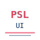

<p align="center">
  
</p>

<h1 align="center">PSL UI — Protocol Specification Language Web Interface</h1>

<p align="center">
  Browse, visualize, and interact with PSL protocol definitions through a modern web UI.
</p>

<p align="center">
  <a href="README.md">English</a> | <a href="README_ZH.md">中文</a>
</p>

---

PSL UI is a web-based frontend for the [protospec](https://github.com/hsqbyte/protospec) project. It runs the full PSL protocol engine directly in the browser via WebAssembly ([protospec-wasm](https://www.npmjs.com/package/protospec-wasm)) — no backend required.

## Screenshot

<p align="center">
  
</p>

## Features

- **Protocol Browser** — Navigate 50+ protocols in a hierarchical tree (Ethernet > IPv4 > TCP > HTTP)
- **Protocol Detail View** — View complete protocol definitions including fields, metadata, RFC links, and dependencies
- **Bit/Byte Diagram** — Visual bit-level layout diagram of protocol headers
- **Encode/Decode Panel** — Interactively encode JSON to binary hex and decode hex back to JSON
- **Hex Viewer** — Color-coded field highlighting over binary data
- **PSL Source View** — Syntax-highlighted raw `.psl` source display
- **Search** — Find protocols by name, RFC number, layer, or field name
- **i18n** — English and Chinese language support
- **WASM Powered** — Full protocol engine runs in the browser, no server needed

## Tech Stack

- **React 19** + **TypeScript** + **Vite**
- **Tailwind CSS** + **shadcn/ui** (Base UI)
- **react-icons** for all icons
- **[protospec-wasm](https://www.npmjs.com/package/protospec-wasm)** — PSL engine compiled to WebAssembly

## Architecture

This project follows the [Feature-Sliced Design (FSD)](https://feature-sliced.design/) architecture:

```
src/
├── app/            — App entry, routing, global styles
├── pages/          — Page components (organized by route)
├── widgets/        — Composite UI blocks (Layout, HexViewer, BinaryInspector)
├── features/       — User interaction features (Codec, Search)
├── entities/       — Business entities (Protocol model + hooks)
└── shared/         — Shared infrastructure
    ├── ui/         — Base UI components (shadcn/ui)
    ├── lib/        — Utilities, WASM bridge (psl.ts)
    ├── hooks/      — Common hooks (theme, mobile, auth)
    ├── i18n/       — Internationalization
    └── assets/     — Static assets
```

## Getting Started

```bash
# Install dependencies
npm install

# Start development server
npm run dev

# Build for production
npm run build
```

## How It Works

PSL UI loads the [protospec-wasm](https://www.npmjs.com/package/protospec-wasm) package, which contains the protospec Go engine compiled to WebAssembly. On startup, the WASM module is initialized and all 50+ built-in protocol definitions become available in the browser.

No API server is needed — encoding, decoding, and protocol browsing all happen client-side.

## Related Projects

- [protospec](https://github.com/hsqbyte/protospec) — PSL engine and CLI tool ([pkg.go.dev](https://pkg.go.dev/github.com/hsqbyte/protospec))
- [protospec-wasm](https://www.npmjs.com/package/protospec-wasm) — PSL engine as npm package (WebAssembly)

## License

[GPL-3.0](LICENSE)
